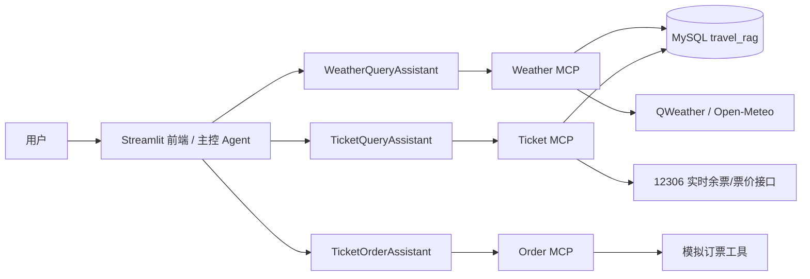

# SmartVoyage · A2A 旅行多智能体助手

[](https://python.org)
[](https://www.langchain.com)
[](https://github.com/a2aproject/a2a-python)
[](https://github.com/modelcontextprotocol/python-sdk)
[](https://streamlit.io)
[](https://www.mysql.com)

> **SmartVoyage 是一个基于 A2A（Agent-to-Agent）协议与 MCP 工具的多智能体旅行助手。** 主控 Agent 负责意图识别、查询改写与任务路由，三个专家 Agent 分别完成天气查询、票务查询与票务预订，并通过 MySQL 数据层和外部实时接口提供可运行、可观测的端到端体验。

## ✨ 核心亮点

- **A2A + MCP 分层架构**：三个专家 Agent 通过 `python-a2a` 暴露为独立服务，每个 Agent 再通过 MCP Streamable HTTP 调用工具，职责清晰、可独立扩展。
- **主控智能路由**：Streamlit 前端内嵌意图识别与查询改写，支持天气、火车票、机票、演出票、订票、景点推荐以及复合意图。
- **火车票实时查询**：火车票查询自动切换至 12306 官方公开余票/票价接口，无需额外 API Key；机票与演出票保留 MySQL 演示数据链路。
- **条件订票编排**：当出现“如果明天北京气温大于 20 度，就订保定到北京的硬座”这类条件任务时，主控会先执行天气/票务 Agent，再把前置结果注入订票 Agent。
- **流式交互体验**：用户问题即时上屏，Agent 执行期间显示处理状态，最终回答按块流式输出。
- **天气数据兜底**：天气数据由 QWeather 抓取写入 MySQL，QWeather 不可用时自动回退 Open-Meteo 免费接口。
- **一键启动**：`start.ps1` 自动准备 MySQL、启动 3 个 MCP 服务、3 个 A2A 服务与 Streamlit 前端。

## 🧭 技术架构



系统采用「前端主控 → A2A 专家 Agent → MCP 工具服务 → 数据/外部接口」的四层结构。A2A 层负责自然语言到结构化查询的转换，MCP 层负责统一工具协议，数据层负责持久化与外部实时数据接入。

## 📋 项目简介

- 🧭 **主控 Agent**：识别用户意图，改写模糊查询，追问缺失信息，并把多意图响应汇总成最终回复。
- 🌤️ **天气查询 Agent**：将自然语言转换为天气 SQL，查询 MySQL 中由 `utils/spider_weather.py` 定期更新的天气数据。
- 🎫 **票务查询 Agent**：火车票优先走 12306 实时接口；机票、演唱会票查询本地 MySQL 演示数据。
- 🛒 **票务预订 Agent**：先调用票务查询 Agent 获取余票，再根据天气等前置条件决定是否执行模拟订票工具。
- 💻 **前端体验**：Streamlit 实现快捷示例、Agent 卡片、路由状态展示、流式输出与多轮对话。

## 🏗️ 项目结构

```text
SmartVoyage/
├── app.py                        # Streamlit 前端与主控编排
├── main.py                       # 控制台版主控入口
├── main_prompts.py               # 意图识别与结果汇总提示词
├── config.py                     # 配置读取（.env + config.ini）
├── create_logger.py              # 日志初始化
├── start.ps1 / stop.ps1          # 一键启动 / 停止脚本
├── 启动SmartVoyage.bat
├── 停止SmartVoyage.bat
├── requirements.txt              # 精确版本依赖
├── .env.example                  # 环境变量示例
├── config.ini.example            # 非敏感配置示例
├── docker-compose.yml            # MySQL 中间件
├── a2a_server/                   # A2A 专家 Agent
│   ├── weather_server.py
│   ├── ticket_server.py
│   └── order_server.py
├── mcp_server/                   # MCP 工具服务
│   ├── mcp_weather_server.py
│   ├── mcp_ticket_server.py
│   └── mcp_order_server.py
├── query_data/                   # 数据库查询与实时票务服务
│   ├── query1.py
│   └── realtime_train_service.py
├── utils/                        # 天气抓取、格式化等工具
│   ├── spider_weather.py
│   └── format.py
├── sql/                          # 建表与演示数据 SQL
├── docker/
│   └── mysql-init/00_init.sql
└── test/                         # Agent / 接口测试脚本
```

## 🚀 快速开始

### 1. 环境准备

推荐 Python 3.10，使用独立虚拟环境：

```powershell
cd SmartVoyage
python -m venv .venv
.\.venv\Scripts\Activate.ps1
pip install -r requirements.txt
```

### 2. 配置环境变量

```powershell
Copy-Item .env.example .env
Copy-Item config.ini.example config.ini
```

编辑 `.env`，至少填写 `LLM_API_KEY`；如需使用 QWeather 更新天气数据，还需填写 `QWEATHER_API_KEY`。

```ini
LLM_API_KEY=change_me
LLM_BASE_URL=https://api.deepseek.com
LLM_MODEL=deepseek-chat

QWEATHER_API_KEY=change_me

MYSQL_HOST=localhost
MYSQL_PORT=3309
MYSQL_USER=root
MYSQL_PASSWORD=change_me
MYSQL_ROOT_PASSWORD=change_me
MYSQL_DATABASE=travel_rag
```

### 3. 准备 MySQL

推荐使用 Docker：

```powershell
docker compose up -d mysql
```

容器初始化时会自动执行 `docker/mysql-init/00_init.sql`，创建 `travel_rag` 库并写入演示数据。

也可以使用 `start.ps1` 通过本机 `mysqld.exe` 启动项目本地 MySQL。若使用此方式，请先创建 `runtime/mysql-bin.txt`，内容指向本机 `mysqld.exe` 路径。

### 4. 一键启动

直接双击 `启动SmartVoyage.bat`，或在 PowerShell 中执行：

```powershell
powershell.exe -NoProfile -ExecutionPolicy Bypass -File .\start.ps1
```

启动完成后浏览器会自动打开 `http://127.0.0.1:8502`。

停止服务请双击 `停止SmartVoyage.bat`。

### 手动启动

如需手动调试，可从仓库父目录分别启动以下模块：

```powershell
# 3 个 MCP 服务
python -m SmartVoyage.mcp_server.mcp_weather_server
python -m SmartVoyage.mcp_server.mcp_ticket_server
python -m SmartVoyage.mcp_server.mcp_order_server

# 3 个 A2A 服务
python -m SmartVoyage.a2a_server.weather_server
python -m SmartVoyage.a2a_server.ticket_server
python -m SmartVoyage.a2a_server.order_server

# 前端
streamlit run SmartVoyage/app.py --server.port 8502
```

## 🔌 端口映射

| 服务 | 端口 |
| --- | --- |
| Streamlit 前端 | `8502` |
| MySQL | `3309` |
| 天气 MCP | `8002` |
| 票务 MCP | `8001` |
| 订票 MCP | `8003` |
| 天气 A2A | `5005` |
| 票务 A2A | `5006` |
| 订票 A2A | `5007` |

## 📡 实时数据源

### 火车票

`query_data/realtime_train_service.py` 调用 12306 官方公开查询页使用的接口：

- 余票：`https://kyfw.12306.cn/otn/leftTicket/queryG`
- 票价：`https://kyfw.12306.cn/otn/leftTicket/queryTicketPrice`
- 车站三字码：`station_name.js`

该数据源免登录、免 API Key，仅做只读查询。12306 无官方第三方开放 API，接口可能因风控或预售期限制返回空结果，本项目仅用于学习研究。

### 天气

`utils/spider_weather.py` 每日定时抓取天气数据：

- 主数据源：QWeather 30 天预报
- 免费兜底：Open-Meteo 近 7 天预报
- 写入表：`weather_data`

## 🧪 示例查询

- “北京今天天气怎么样？”
- “查一下 2026-10-04 北京到上海的火车票，二等座”
- “保定到北京明天的硬座还有吗？”
- “推荐北京必去的景点”
- “如果明天北京气温大于 20 度，就订一张保定到北京的火车票（硬座）”

## 🔧 技术栈

| 层级 | 核心技术 | 作用 |
| --- | --- | --- |
| 前端 | `Streamlit` | 多轮对话、流式输出、Agent 状态展示 |
| 主控 | `LangChain` + `langchain-openai` | 意图识别、查询改写、结果汇总 |
| A2A | `python-a2a` | 三个专家 Agent 服务与任务路由 |
| MCP | `mcp` + `FastMCP` | 天气、票务、订票工具服务 |
| 数据 | `MySQL` + `mysql-connector-python` | 天气、火车票、机票、演出票数据存储 |
| 实时票务 | `requests` + 12306 公开接口 | 火车票余票与票价查询 |
| 天气抓取 | `requests` + `schedule` | QWeather / Open-Meteo 数据同步 |
| 配置 | `python-dotenv` + `configparser` | `.env` 与 `config.ini` 双层配置 |

## ⚠️ 免责声明

本项目为多智能体旅行助手的教学与演示项目。火车票实时接口数据来源于 12306 公开查询页面，订票工具为模拟实现，不产生真实订单与支付；天气、票务与景点信息仅供参考，出行前请以官方渠道为准。

## 📞 联系方式

如有问题或建议，请提交 GitHub Issue。
