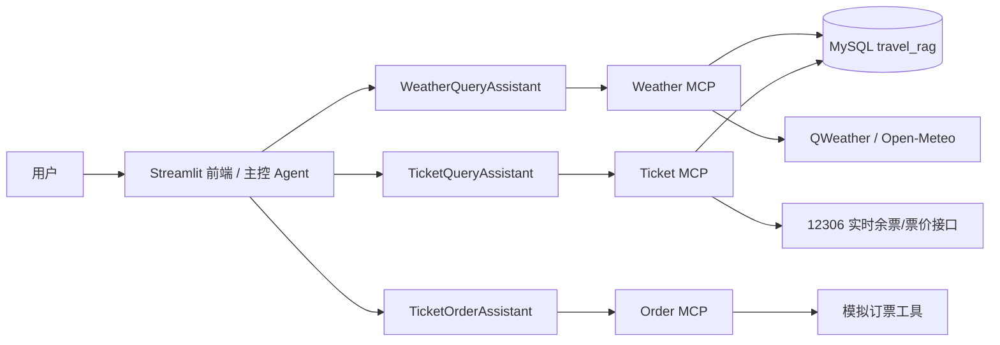

# SmartVoyage · A2A 旅行多智能体助手

[](https://python.org)
[](https://www.langchain.com)
[](https://github.com/a2aproject/a2a-python)
[](https://github.com/modelcontextprotocol/python-sdk)
[](https://streamlit.io)
[](https://www.mysql.com)

> **SmartVoyage 是一个可运行的 A2A + MCP 多智能体旅行助手。** 系统以 A2A 协议定义 Agent 间的通信边界，以 MCP Streamable HTTP 统一工具调用，以 Streamlit 作为主控编排入口；从意图识别、并行任务调度、依赖注入、实时数据接入到流式展示，形成一条完整的多智能体工程链路，可作为 Agent 架构落地与二次开发的参考实现。

## ✨ 核心亮点

- **协议分层，而非单进程堆叠**：三个专家 Agent 通过 `python-a2a` 独立部署，各自声明 `AgentCard` 与 `AgentSkill`；主控只依赖 A2A 任务协议与远端服务，不直接触碰专家内部状态，Agent 可独立替换、扩容和调试。
- **MCP 工具与 Agent 解耦**：天气、票务、订票分别由 FastMCP 以 Streamable HTTP 暴露工具服务，专家 Agent 作为 MCP Client 调用，工具实现可以独立演进，不改变 A2A 层契约。
- **结构化意图路由与上下文改写**：`main_prompts.py` 将意图识别、查询改写、歧义追问和 out-of-scope 回复约束为严格 JSON；结合最近 6 轮对话和当前日期，支持天气、火车票、机票、演出票、订票、景点推荐及组合意图。
- **两阶段依赖编排**：主控先通过 `asyncio.gather` 并行执行非订票任务，再执行订票任务，并将上游结果整理为“已知前置信息”注入订票 Agent；在“满足天气条件才订票”等依赖场景下，避免下游任务抢跑或上下文缺失。
- **数据接入适配层**：票务 MCP 先从 Agent 生成的 SQL 中提取车次参数，再交给 `RealtimeTrainTicketService`；后者封装了 12306 会话初始化、车站三字码解析、`queryG/O/Z/A` 多端点回退、余票字段与票价单位归一化，并保持与 MySQL 查询相同的 JSON 契约，A2A 层无需感知底层数据源差异。
- **天气采集的缓存与降级**：`spider_weather.py` 将 QWeather 主源与 Open-Meteo 兜底源统一转换为 `weather_data` 表结构，按城市最近更新时间做 24 小时新鲜度判断，避免重复请求；机票和演出票则使用 MySQL 演示数据，形成可重复、无外部依赖的本地测试通道。
- **可观测的流式交互**：前端展示路由 Agent、任务处理状态和错误信息；最终回答按块渐进渲染，并在整条链路执行期间先输出处理状态，避免页面长时间无反馈。
- **一键启动与统一配置**：`start.ps1` 自动准备 MySQL、启动 3 个 MCP 服务、3 个 A2A 服务和 Streamlit；`.env` 与 `config.ini` 分层管理密钥和运行参数。

## 🧭 技术架构



系统采用「前端主控 → A2A 专家 Agent → MCP 工具服务 → 数据/外部接口」的四层结构。A2A 层承担自然语言到结构化任务的状态管理，MCP 层统一工具协议，数据层封装持久化与外部实时数据接入。实时数据源和模拟订票工具都位于 MCP/数据边界内，可在不改主控与 A2A 契约的前提下替换为真实业务服务。

## 📋 实现拆解

- 🧭 **主控编排层（`app.py`）**：负责意图识别、Agent 路由、非订票任务并行调度、订票任务串行依赖注入、结果汇总、会话历史维护与异常兜底。
- 🌤️ **天气专家 Agent（`a2a_server/weather_server.py`）**：将自然语言转换为结构化 SQL，再通过天气 MCP 查询 `weather_data` 表。
- 🎫 **票务专家 Agent（`a2a_server/ticket_server.py`）**：根据意图生成票务 SQL；火车票 SQL 会由 MCP 层拦截并切换为 12306 实时查询，机票和演出票走 MySQL 演示数据。
- 🛒 **订票专家 Agent（`a2a_server/order_server.py`）**：先调用票务 Agent 获取余票，再把“用户问题 + 余票信息 + 前置条件摘要”交给订票 MCP 执行模拟订票。
- 🔧 **MCP 工具层（`mcp_server/`）**：封装天气查询、票务查询/实时车票查询、火车票/机票/演出票模拟订票工具，统一以 Streamable HTTP 暴露。
- 📡 **数据与接入层（`query_data/`、`utils/`、`sql/`）**：实现 12306 接口封装、QWeather/Open-Meteo 天气抓取、MySQL 建表与演示数据初始化。
- 💻 **交互层（`app.py`）**：Streamlit 提供多轮对话、快捷示例、Agent 状态卡片、路由展示和流式渲染。

## 🏗️ 项目结构

```text
SmartVoyage/
├── app.py                        # Streamlit 前端与主控编排
├── main.py                       # 控制台版主控入口
├── main_prompts.py               # 意图识别与结果汇总提示词
├── config.py                     # 配置读取（.env + config.ini）
├── create_logger.py              # 日志初始化
├── start.ps1 / stop.ps1          # 一键启动 / 停止脚本
├── 启动SmartVoyage.bat
├── 停止SmartVoyage.bat
├── requirements.txt              # 精确版本依赖
├── .env.example                  # 环境变量示例
├── config.ini.example            # 非敏感配置示例
├── docker-compose.yml            # MySQL 中间件
├── a2a_server/                   # A2A 专家 Agent
│   ├── weather_server.py
│   ├── ticket_server.py
│   └── order_server.py
├── mcp_server/                   # MCP 工具服务
│   ├── mcp_weather_server.py
│   ├── mcp_ticket_server.py
│   └── mcp_order_server.py
├── query_data/                   # 数据库查询与实时票务服务
│   ├── query1.py
│   └── realtime_train_service.py
├── utils/                        # 天气抓取、格式化等工具
│   ├── spider_weather.py
│   └── format.py
├── sql/                          # 建表与演示数据 SQL
├── docker/
│   └── mysql-init/00_init.sql
└── test/                         # Agent / 接口测试脚本
```

## 🚀 快速开始

### 1. 环境准备

推荐 Python 3.10，使用独立虚拟环境：

```powershell
cd SmartVoyage
python -m venv .venv
.\.venv\Scripts\Activate.ps1
pip install -r requirements.txt
```

### 2. 配置环境变量

```powershell
Copy-Item .env.example .env
Copy-Item config.ini.example config.ini
```

编辑 `.env`，至少填写 `LLM_API_KEY`；如需使用 QWeather 更新天气数据，还需填写 `QWEATHER_API_KEY`。

```ini
LLM_API_KEY=change_me
LLM_BASE_URL=https://api.deepseek.com
LLM_MODEL=deepseek-chat

QWEATHER_API_KEY=change_me

MYSQL_HOST=localhost
MYSQL_PORT=3309
MYSQL_USER=root
MYSQL_PASSWORD=change_me
MYSQL_ROOT_PASSWORD=change_me
MYSQL_DATABASE=travel_rag
```

### 3. 准备 MySQL

推荐使用 Docker：

```powershell
docker compose up -d mysql
```

容器初始化时会自动执行 `docker/mysql-init/00_init.sql`，创建 `travel_rag` 库并写入演示数据。

也可以使用 `start.ps1` 通过本机 `mysqld.exe` 启动项目本地 MySQL。若使用此方式，请先创建 `runtime/mysql-bin.txt`，内容指向本机 `mysqld.exe` 路径。

### 4. 一键启动

直接双击 `启动SmartVoyage.bat`，或在 PowerShell 中执行：

```powershell
powershell.exe -NoProfile -ExecutionPolicy Bypass -File .\start.ps1
```

启动完成后浏览器会自动打开 `http://127.0.0.1:8502`。

停止服务请双击 `停止SmartVoyage.bat`。

### 手动启动

如需手动调试，可从仓库父目录分别启动以下模块：

```powershell
# 3 个 MCP 服务
python -m SmartVoyage.mcp_server.mcp_weather_server
python -m SmartVoyage.mcp_server.mcp_ticket_server
python -m SmartVoyage.mcp_server.mcp_order_server

# 3 个 A2A 服务
python -m SmartVoyage.a2a_server.weather_server
python -m SmartVoyage.a2a_server.ticket_server
python -m SmartVoyage.a2a_server.order_server

# 前端
streamlit run SmartVoyage/app.py --server.port 8502
```

## 🔌 端口映射

| 服务 | 端口 |
| --- | --- |
| Streamlit 前端 | `8502` |
| MySQL | `3309` |
| 天气 MCP | `8002` |
| 票务 MCP | `8001` |
| 订票 MCP | `8003` |
| 天气 A2A | `5005` |
| 票务 A2A | `5006` |
| 订票 A2A | `5007` |

## 📡 实时数据源

### 火车票

`query_data/realtime_train_service.py` 调用 12306 官方公开查询页使用的接口：

- 余票：`https://kyfw.12306.cn/otn/leftTicket/queryG`
- 票价：`https://kyfw.12306.cn/otn/leftTicket/queryTicketPrice`
- 车站三字码：`station_name.js`

该数据源免登录、免 API Key，仅做只读查询。12306 无官方第三方开放 API，接口可能因风控或预售期限制返回空结果，本项目仅用于学习研究。

### 天气

`utils/spider_weather.py` 每日定时抓取天气数据：

- 主数据源：QWeather 30 天预报
- 免费兜底：Open-Meteo 近 7 天预报
- 写入表：`weather_data`

## 🧪 示例查询

- “北京今天天气怎么样？”
- “查一下 2026-10-04 北京到上海的火车票，二等座”
- “保定到北京明天的硬座还有吗？”
- “推荐北京必去的景点”
- “如果明天北京气温大于 20 度，就订一张保定到北京的火车票（硬座）”

## 🔧 技术栈

| 层级 | 核心技术 | 作用 |
| --- | --- | --- |
| 前端 | `Streamlit` | 多轮对话、流式输出、Agent 状态展示 |
| 主控 | `LangChain` + `langchain-openai` | 意图识别、查询改写、结果汇总 |
| A2A | `python-a2a` | 三个专家 Agent 服务与任务路由 |
| MCP | `mcp` + `FastMCP` | 天气、票务、订票工具服务 |
| 数据 | `MySQL` + `mysql-connector-python` | 天气、火车票、机票、演出票数据存储 |
| 实时票务 | `requests` + 12306 公开接口 | 火车票余票与票价查询 |
| 天气抓取 | `requests` + `schedule` | QWeather / Open-Meteo 数据同步 |
| 配置 | `python-dotenv` + `configparser` | `.env` 与 `config.ini` 双层配置 |

## ⚠️ 免责声明

本项目为多智能体旅行助手的教学与演示项目。火车票实时接口数据来源于 12306 公开查询页面，订票工具为模拟实现，不产生真实订单与支付；天气、票务与景点信息仅供参考，出行前请以官方渠道为准。

## 📞 联系方式

如有问题或建议，请提交 GitHub Issue。
